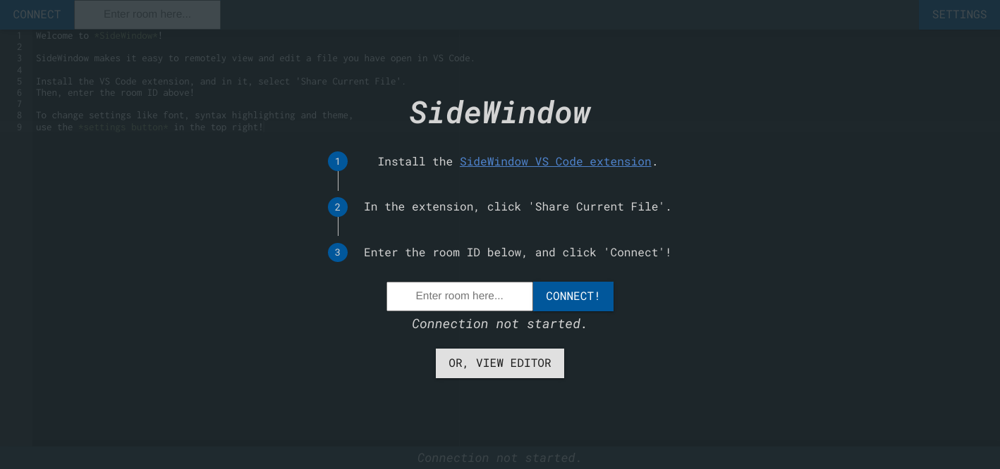
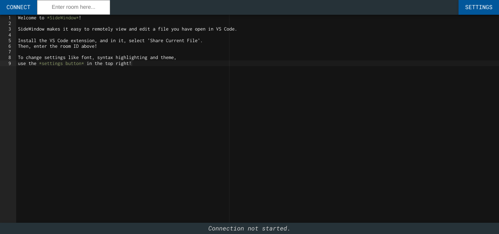

# SideWindow

SideWindow lets you cast your editor contents to other devices, enabling you to view and edit your code remotely.

* Use SideWindow to view/edit code on your phone, or another device, like a second monitor. Or, collaborate with someone remotely!

* SideWindow is lightweight, super convenient and quick to set up for lighter use cases.  If you're looking for a more fully-featured remote solution, the VS Code Live Share extension is where you may want to look.

* The repo for the extension is hosted here: [https://github.com/alextobias/sidewindow-extension](https://github.com/alextobias/sidewindow-extension)

* The repo for the webapp/client is hosted here: [https://github.com/alextobias/sidewindow](https://github.com/alextobias/sidewindow)

## Features

* SideWindow lets you view and edit your editor contents on other devices. 

* It does this by connecting to the SideWindow webapp: [sidewindow.herokuapp.com](https://sidewindow.herokuapp.com)

* In the extension menu, you'll find a button to share your active editor contents. When you do, you'll receive a room ID. 

* Enter the room ID in the webapp from another device to instantly access your code - it's that simple!

* SideWindow supports multiple clients connected to the same room, so you could have multiple devices connected simultaneously!

## Background

* I built SideWindow because I like to code on my laptop, and wanted to be able to use my phone like a second monitor.

* You could use it to pull up code on your phone like me, or you could use it to edit on separate computers/laptops/devices etc. You could also use it to edit collaboratively with someone else. 

## Release Notes

### 1.0.0

* Initial release of SideWindow.